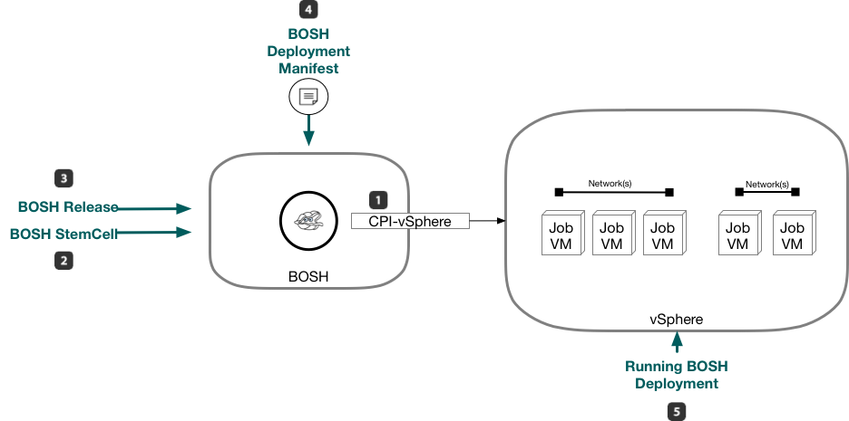
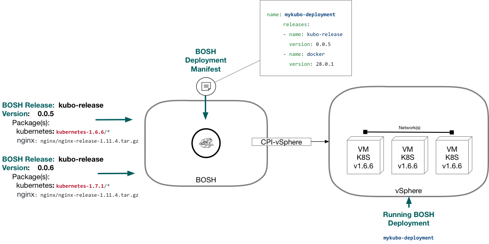
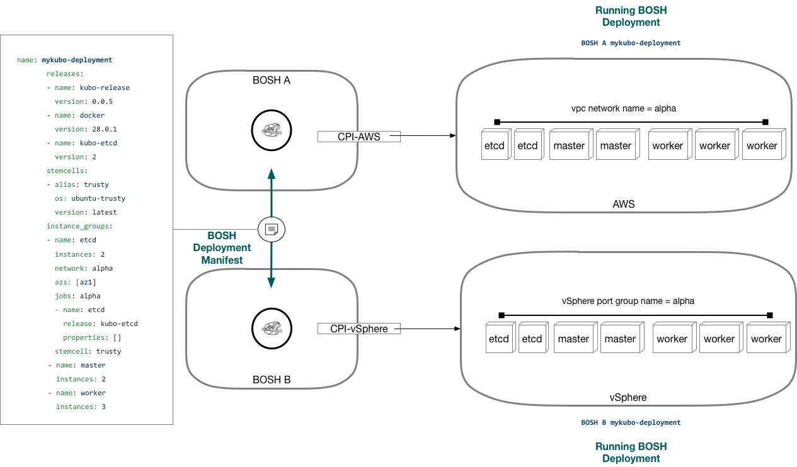
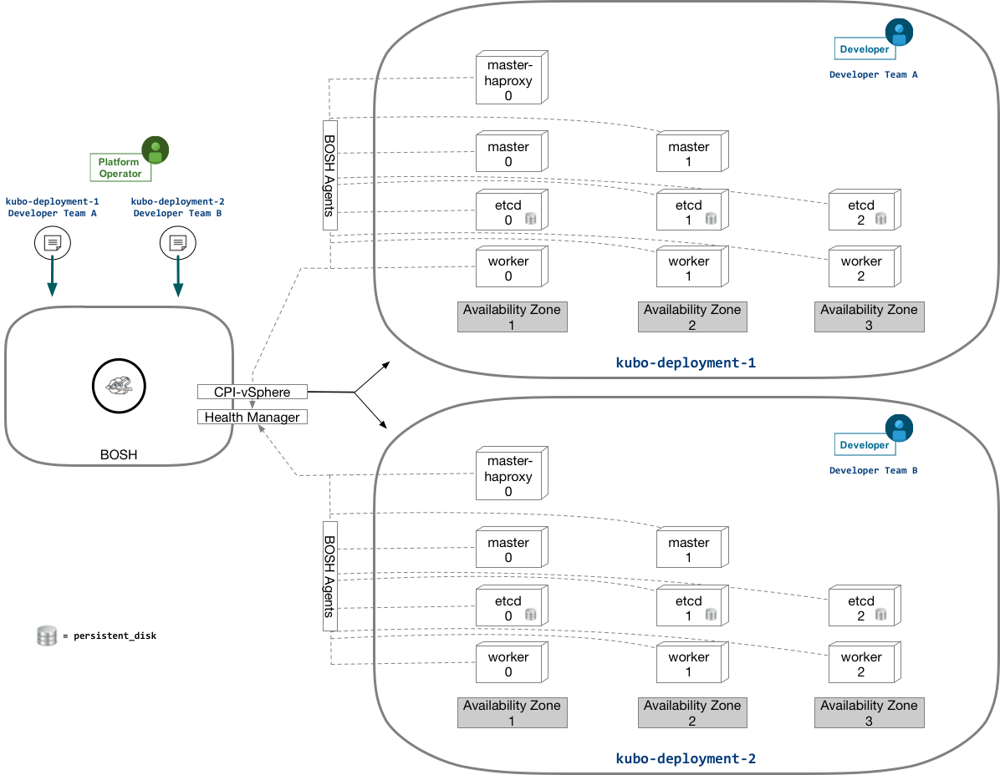
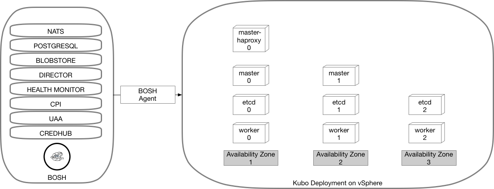

---

# Introduction to BOSH


### Table Of Contents

- What is BOSH
  - Overview
  - What Problems does BOSH solve?
  - Use Case(s)
- Deploying BOSH
  - BOSH Architecture
  - BOSH References
  - CookBook: how to deploy "KUBO"


### What is BOSH


#### BOSH Overview 

BOSH is an open source tool that enables deployment and lifecycle management of distributed systems.   It is the primary method to deploy Cloud Foundry and is contributed to by many key members of the Cloud Foundry Foundation such as Google, Pivotal, & VMware.  It can support deployments across many different IaaS providers. Some of these providers are:

- VMware vSphere
- Google Compute Platform
- Amazon Web Services EC2
- Microsoft Azure
- Openstack




BOSH accomplishes deployments by creating some major abstraction objects to make it easy and repeatable to deploy complex systems.

1. **CPI**:  The CPI is the executable library that BOSH uses to interact with any given IaaS.  There is a CPI available per each BOSH supported IaaS, and when you deploy the BOSH instance(s) you can define which one(s) it will use.   In the image above, the vSphere CPI is shown.  It allows BOSH to perform all the required IaaS actions such as creating a VM or instance as well as various other instance, network, and storage primitives required to instantiate a deployment.
2. **BOSH Stemcell**: A Stemcell is a versioned base operating system image built for each CPI that BOSH supports.  Its commonly based on Canonical's ubuntu distribution,  but is also available in RHEL and even Windows image ports.  The Stemcell typically is a hardened base OS image with a BOSH agent pre deployed.  BOSH will use this agent to install and manage the lifecycle of software on that VM or instance.
3. **BOSH Release**: A bosh release is a versioned tarball containing all source code as well as job definitions to describe to BOSH how that release of software should be deployed on a VM or instance provisioned from a stemcell.  An Example is the [kubo release] (https://github.com/cloudfoundry-incubator/kubo-release) that includes all the required packages and detail to allow BOSH to deploy a fully functional Kubernetes cluster.
4. **BOSH Deployment Manifest**: BOSH needs to have some declarative information to actually deploy something.  This is provided by an operator via a manifest.  A manifest defines one or more __*releases*__ and __*stemcells*__ to be used in a deployment and provides some key variables like IPstack info, instance count, and advanced configuration of the given release(s) you want to deploy.  This manifest is typically written in a YAML format.
5. **BOSH Deployment**: A BOSH deployment is a given instantiation of a BOSH deployment manifest.  BOSH will deploy the versioned releases & stemcells defined in the manifest yaml and will maintain the health and availability through the lifetime of the VMs or instances it deploys.  Each VM or instance will be given one or more 'jobs' defined in the BOSH release and are therefore sometimes referred to as job instances. 

#### What Problems does BOSH solve?

BOSH allows BOSH Release developers to easily version, package and deploy software in a reproducible manner.  Operators can consume BOSH releases and be guaranteed that deployment are ~~repeatable~~ with predictable results across environments.   To accomplish this , BOSH release developers focus on providing some key functions when building a release:


- **Identifiability**

An operator needs to be able to document the deployment of software and its versions.   A BOSH release ,by design, requires the developer to document and package everything in the release.   The release itself must also be versioned.  This allows an Operator to fully understand what is deployed as well as consistently upgrade or downgrade versions of software in a release.  For Example:
	
	


__For Example__: In the image above,  an operator defining a deployment, can refer to one or more versioned releases.  This gives an identifiable pattern to determine versions of software used in a deployment.  BOSH has two versions of the kubo release available, 0.0.5 & 0.0.6.    The operator has defined the use of version 0.0.5 of the release,  which will enforce the use of kubernetes version 1.6.6 across the deployment caled mykubo-deployment.

- **Reproducibility**

Another key tenant in releasing software that BOSH addresses is reproducibility.  To an operator, this means that software should be deployed exactly the same across multiple environments in order to guarantee operational stability.

	
__For Example__: In the image above, a single manifest can deploy something like Kubernetes in a consistent way, providing the same functional deployment with the same releases across multiple environments.  Those environments can even cross multiple IaaS providers by using the CPI abstraction.   The simplifoed partial deployment manifest in the image is declaring which __BOSH stemcell__ , __BOSH Release__ , and config data to use to deploy functionally identical kubernetes clusters in two different environments.


- **Consistency**

BOSH also enforces consistency in BOSH release development to ensure that virtually any software can be packaged, versioned and deployed in a similar pattern.  This also provides operational stability.


#### BOSH Use Cases

The primary value of bosh is to simplify the deployment of and day 2 lifecycle management of complex systems.  It was primarily developed to deploy Cloud Foundry but has been extended to deploy many simple and complex environments by developers publishing BOSH releases.   These systems that BOSH can deploy can be found in two primary locations.  The first location is [Pivotal Network](https://network.pivotal.io/), where Pivotal curates commercial BOSH releases of Pivotal Cloud Foundry as well as Pivotal Services that are typically driven by Pivotal Operations Manager + BOSH.  The second location is [BOSH.io](http://bosh.io/releases), which hosts an OSS community repo of various systems that can be deployed.  An example of a prime BOSH use case is:

##### Kubernetes powered by BOSH or KUBO

    

BOSH can be used to deploy and simplify management of complex systems like [Kubernetes via KUBO](https://github.com/cloudfoundry-incubator/kubo-deployment).  Referencing the image above we can see some key benefits BOSH has provided the Operator.

1.  **Repeatability**:  In a cloud native development environemnt, the Operator can generate 2 or similar deployment manifests to deploy 2 or more unique but functionally identical Kubernetes deployments to meet the needs of multiple Devloper consumers.  
2. **Day 2 Operations**:  BOSH lifecycle management makes keeping all of the Kubernetes deployments healthy.  
    - **Maintain Health** Each VM or instance deployed by BOSH also deploys an agent that communicates health back to BOSH.  In the event a KUBO node is unhealthy,  BOSH will automatically try to repair and or rebuild the affected node.  This improves uptime.
    - **Increase Uptime** Each VM or instance can have multiple instances distributed across availability zones to ensure services provided are not affected by a physical faults in an availability zone.   Availability Zones are only supported on certain CPIs , like the vSphere CPI where availability zones map to vCenter clusters.
    - **Patching** Because BOSH uses versioned releases,  its trivial for an operator to upgrade the kubernetes KUBO release and apply it to all running deployments.   BOSH will update each deployment and maintain state of each deployment  by use of (1) detaching persistent disks, (2) rebuilding the affected VMs or instances, and then (3) re-attaching persistent disks.

### Deploying BOSH

#### BOSH Architecture



BOSH is typically deployed as a single VM or Instance.  That VM/instance has many components that perform vital roles in how BOSH manages deployments at scale:

- **NATS**: Provides a message bus for the various services of BOSH to interact
- **POSTGRESQL**:  BOSH writes all of its state into a database.  Typically that database is internal to a single VM BOSH deployment and provided by Postgres.  This can however be modified to use an external data source so that  BOSH VM could be rebuilt and reconnect to the database to reload its persistent state.
- **BLOBSTORE**: Each stemcell and release uploaded to BOSH is stored in a blobstore.  Default deployments of BOSH use an internal store (webdav), but like the Postgresql database,  this can also be externalized.
- **Director**: Is the main API that the BOSH CLI will interface with to allow an operator to create and manage BOSH deployments.
- **Health Monitor**:  BOSH requires that each VM it deploys have an agent that it can communicate with to assign and deploy jobs from BOSH releases defined in a deployment manifest. It will also maintain the health of each VM/instance it has deployed.  The agent will report vitals back to BOSH and in cases where Services are faulted or the agent is unreachable, the HealthMonitor can use plugins to restart services and even rebuild VMs/instances.
- **CPI**:  The CPI is the executable library that BOSH uses to interact with any given IaaS
- **UAA**: Or User Access & Authentication allows BOSH to authenticate operators via SAML or LDAP backends
- **CREDHUB**: Manages credentials like passwords, certificates, certificate authorities, ssh keys, rsa keys and arbitrary values (strings and JSON blobs).  BOSH will leverage credhub to create and store key credentials for deployments, like public certificates & keys.

Full reference on BOSH can be found here: [BOSH.io](http://bosh.io)

#### CookBook: How to deploy "KUBO"

BOSH is deployed by using the [BOSH CLI](http://bosh.io/docs/cli-v2.html),   passing the correct cmd line arguments or storing variable data within additional yml files define how BOSH itself is deployed.  This 'CookBook' section will assist in deploying a basic Kubo deployment.

##### Steps To deploy BOSH (Mac OSX) ...
Operating System Specific Installation of CLI is documented [here](http://bosh.io/docs/cli-v2.html).

**Get the BOSH CLI ...**

`1. sudo wget -O /usr/local/bin/bosh https://s3.amazonaws.com/bosh-cli-artifacts/bosh-cli-2.0.28-darwin-amd64 && sudo chmod 755 /usr/local/bin/bosh`

**Prepare MAC OS requirements like Ruby ...**

- Other OS Specific Instructions can be found [here](http://bosh.io/docs/cli-v2.html) & [here](http://bosh.io/docs/cli-env-deps.html)

```
2. gem update --system
3. xcode-select --install
4. brew install openssl
```

**Use GIT Client to Clone the BOSH Deployment repo ...**

```
5. git clone https://github.com/cloudfoundry/bosh-deployment
6. cd bosh-deployment
```

**Deploy BOSH ...**

```
7. /usr/local/bin/bosh create-env bosh.yml \
    --state=mystate.json \
    --vars-store=mycreds.yml \
    -o vsphere/cpi.yml \
    -v director_name=kubobosh \
    -v internal_cidr=10.40.206.128/25 \
    -v internal_gw=10.40.206.253 \
    -v internal_ip=10.40.206.130 \
    -v network_name="CNA-API" \
    -v vcenter_dc="Datacenter-PCF" \
    -v vcenter_ds=NFS-LAB-DATASTORE \
    -v vcenter_ip=10.40.206.61 \
    -v vcenter_user=administrator@vsphere.local \
    -v vcenter_password=BLAH! \
    -v vcenter_templates=bosh-mg-templates \
    -v vcenter_vms=bosh-mg-vms \
    -v vcenter_disks=bosh-mg-disks \
    -v vcenter_cluster="Cluster-PCF"
    
8. /usr/local/bin/bosh alias-env kubobosh -e 10.40.206.130 --ca-cert <(/usr/local/bin/bosh int ./mycreds.yml --path /director_ssl/ca)
9. /usr/local/bin/bosh -e kubobosh login

```

##### Steps To Deploy Kubo on BOSH ...

Will add details in AM MG ...

1. Git Clone https://github.com/cloudfoundry-incubator/kubo-deployment
2. Generate manifests
3. Deploy KUBO